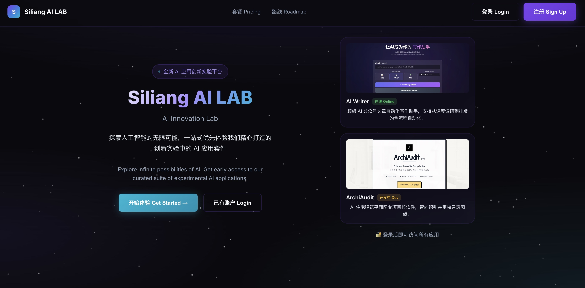

# Siliang AI LAB

**思量 AI 实验室** - AI 应用统一门户平台

## 项目简介

Siliang AI LAB 是一个 AI 应用主门户系统，提供：

- 用户登录/注册功能
- 用户管理（管理员 + 普通用户）
- 应用仪表板（管理多个 AI Web 应用）
- 应用权限管理系统

## 在线访问

| 服务 | 地址 |
|------|------|
| 主门户 | https://siliang.cfd |
| AI Writer | https://writer.siliang.cfd |
| API 服务 | https://api.siliang.cfd |

## 功能截图



## 技术栈

| 层级 | 技术 |
|------|------|
| 前端 | HTML5 + CSS3 + Vanilla JavaScript |
| 后端 | Python + Flask |
| 数据库 | SQLite |
| 部署 | Vercel (前端) + 阿里云 (后端) |

## 项目结构

```
siliang-ai-lab/
├── web/                    # 前端文件
│   ├── index.html          # 首页/登录
│   ├── dashboard.html      # 用户仪表板
│   ├── admin.html          # 管理面板
│   ├── css/
│   ├── js/
│   └── images/
├── backend/                # Flask 后端
│   ├── app.py              # 主应用
│   └── database.py         # 数据库模型
├── deploy/                 # 部署配置
│   ├── nginx.conf
│   └── *.service
└── LOG.md                  # 开发日志
```

## 快速开始

### 本地开发

```bash
# 克隆仓库
git clone https://github.com/SM01-studio/siliang-ai-lab.git
cd siliang-ai-lab

# 安装后端依赖
cd backend
pip install -r ../deploy/requirements.txt

# 启动后端
python app.py

# 访问前端
# 打开浏览器访问 http://localhost:5000
```

### 默认管理员账号

- 邮箱：`admin@siliang.cfd`
- 密码：`admin123`

## 权限系统

| 用户类型 | 默认权限 | 说明 |
|---------|---------|------|
| 管理员 | 所有应用 | 无需手动分配 |
| 普通用户 | 无 | 必须由管理员分配 |

## 相关项目

- [AI Article Writer](https://github.com/SM01-studio/AI-article-writer) - AI 公众号文章自动化写作助手

## License

MIT License

---

© 2026 Siliang AI LAB
